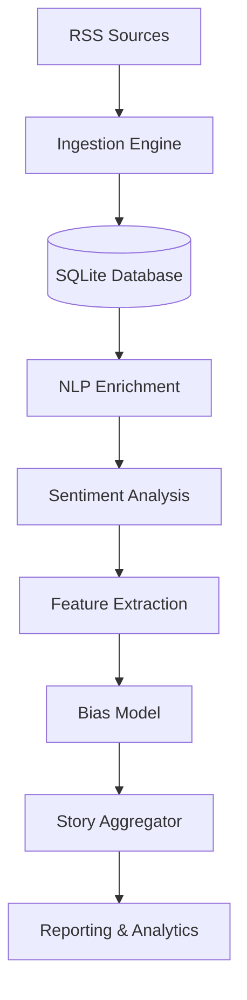

# Bias-Detector 📰⚖️

An automated pipeline designed to ingest, process, and analyze media bias across diverse news sources using Natural Language Processing (NLP) and Machine Learning.

## 🚀 Overview

Bias-Detector fetches news headlines from over 15 global and regional (Indian) RSS feeds, enriches them with NLP metadata, clusters them into unified stories, and calculates bias scores based on sentiment variance and source leanings.

### Key Features
- **Automated Ingestion**: Real-time fetching from sources like Reuters, AP, BBC, The Hindu, Fox News, and more.
- **NLP Pipeline**: Deep linguistic analysis including Named Entity Recognition (NER), POS tagging, and dependency parsing via `spaCy`.
- **Sentiment Analysis**: Entity-level and headline-level sentiment scoring using `VADER`.
- **Semantic Clustering**: Grouping related headlines into "Stories" using `Sentence-Transformers` (MiniLM-L6-v2) and Cosine Similarity.
- **Bias Scoring**: A multi-factor scoring mechanism that evaluates framing, sentiment intensity, and source-level leanings.
- **Analytics Reporting**: Generation of statistical insights to visualize media trends.

---

## 🛠️ Architecture



---

## ⚙️ Installation

### Prerequisites
- Python 3.9+
- [Spacy Model](https://spacy.io/models/en): `en_core_web_sm`

### Setup
1. **Clone the repository**:
   ```bash
   git clone https://github.com/your-username/Bias-Detector.git
   cd Bias-Detector
   ```

2. **Create a virtual environment**:
   ```bash
   python -m venv venv
   source venv/bin/activate  # On Windows: venv\Scripts\activate
   ```

3. **Install dependencies**:
   ```bash
   pip install -r requirements.txt
   ```

4. **Download NLP models**:
   ```bash
   python -m spacy download en_core_web_sm
   python -c "import nltk; nltk.download('vader_lexicon')"
   ```

---

## 📖 Usage

### Running the Full Pipeline
The main entry point executes the entire flow from ingestion to reporting:
```bash
python main.py
```

### Utility Scripts
All auxiliary tools are located in the `scripts/` directory. Run them from the project root:
- **Verify Stats**: `python scripts/verify_bias.py`
- **Export Entities**: `python scripts/export_entities.py`
- **Manual Analysis**: `python scripts/run_analysis.py`

---

## 🧪 Methodology

### 1. NLP Processing
Each headline is tokenized and analyzed for named entities (ORGs, GPEs, PERSONs). We use dependency parsing to identify the target of sentiment in framing.

### 2. Semantic Clustering
To compare how different outlets cover the same news, we use `all-MiniLM-L6-v2` embeddings to map headlines to a high-dimensional vector space. Headlines with a Cosine Similarity > 0.7 are grouped into a single "Story cluster".

### 3. Bias Scoring
Bias is calculated using:
- **Sentiment Polarity**: Deviation from "Center" sentiment.
- **Entity Framing**: How specific actors are described across different clusters.
- **Source Lean Index**: Pre-configured political leanings (Left, Center, Right) as a baseline for comparison.

---

## 🗺️ Future Roadmap
- [ ] Integration with Large Language Models (LLMs) for deeper framing analysis.
- [ ] Real-time Dashboard using Streamlit or FastAPI.
- [ ] Support for non-English sources and multilingual embeddings.

---

## 📄 License
Distributed under the **MIT License**. See `LICENSE` for more information.

---

## 🤝 Contributing
Contributions are welcome! Please feel free to submit a Pull Request.
